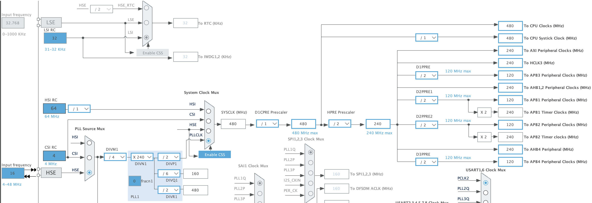
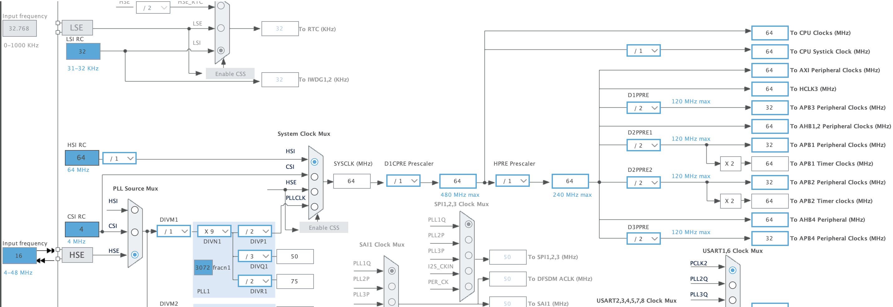

# STM32 Configurations ⚙️

## Clock config ⏱️

RCC:
- HSE: Crystal Resonator

### Config for max frequency of 480Mhz


### Config for first bringup


## RGB Led config 💡

CubeMX Configuration — RGB LED (Common Anode) with TIM4

### Timer Setup

Navigate to **Timers → TIM4** in the `.ioc` file.

| Setting | Value |
|---|---|
| Clock Source | Internal Clock |
| Channel 1 | PWM Generation CH1 (Red) |
| Channel 2 | PWM Generation CH2 (Green) |
| Channel 3 | PWM Generation CH3 (Blue) |

### Parameter Settings

| Parameter | Value | Notes |
|---|---|---|
| Prescaler (PSC) | 79 | For 80 MHz clock → 1 MHz timer clock |
| Counter Mode | Up | |
| Counter Period (ARR) | 999 | Gives 1 kHz PWM frequency |
| PWM Mode (all channels) | **PWM Mode 2** | Inverts output for common anode |
| Pulse / CCR (all channels) | 0 | LED starts OFF with Mode 2 |

> **PWM frequency formula:** `PWM_freq = Timer_clock / ((PSC+1) × (ARR+1))`  
> Adjust PSC if your system clock differs from 80 MHz.

### Pin Assignment

Map TIM4_CH1, CH2, CH3 to the GPIO pins connected to your RGB LED in the **Pinout view**. Verify the alternate function (AF) mapping matches your PCB routing in the STM32 datasheet.

### Code — Start PWM

```c
HAL_TIM_PWM_Start(&htim4, TIM_CHANNEL_1); // Red
HAL_TIM_PWM_Start(&htim4, TIM_CHANNEL_2); // Green
HAL_TIM_PWM_Start(&htim4, TIM_CHANNEL_3); // Blue
```

### Code — Set Color

With **PWM Mode 2**, the logic is intuitive: `0` = OFF, `999` = full brightness.

```c
void RGB_SetColor(uint16_t red, uint16_t green, uint16_t blue)
{
    __HAL_TIM_SET_COMPARE(&htim4, TIM_CHANNEL_1, red);
    __HAL_TIM_SET_COMPARE(&htim4, TIM_CHANNEL_2, green);
    __HAL_TIM_SET_COMPARE(&htim4, TIM_CHANNEL_3, blue);
}

// Examples
RGB_SetColor(999,   0,   0); // Red
RGB_SetColor(  0, 999,   0); // Green
RGB_SetColor(  0,   0, 999); // Blue
RGB_SetColor(999, 999, 999); // White
RGB_SetColor(  0,   0,   0); // Off
```

### Notes

- **Common Anode** → PWM Mode 2 is used to invert the signal (pin LOW = LED on).
- Ensure current-limiting resistors are fitted in series with each LED leg (typically 33–100 Ω).
- If TIM4 channels cannot be routed to your PCB pins, any timer with 3 channels (TIM2, TIM3…) can be used with the same configuration.